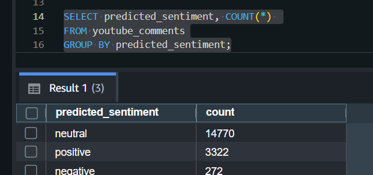
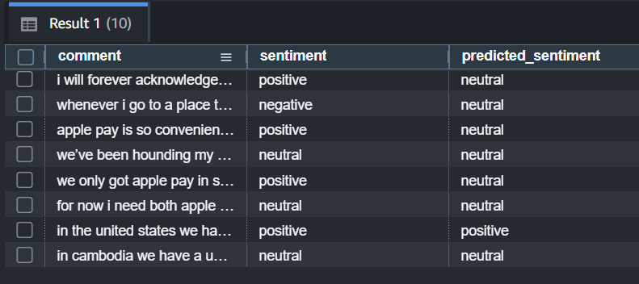

# YouTube Comments Sentiment Analysis - AWS Data Engineering Project

## Overview
This project demonstrates an end-to-end data engineering workflow using **AWS S3 + AWS Glue + Python Pandas + Amazon Redshift** to analyze YouTube comments for sentiment.

### Key Features
- Read raw comments CSV from S3
- Perform data cleaning and sentiment classification (`positive`, `negative`, `neutral`) using Python Pandas in AWS Glue
- Load processed data into Amazon Redshift using SQL COPY commands for validation and analysis.
- Run SQL queries in Redshift to validate, aggregate, and explore data

### Tools & Services
- AWS S3 (raw and processed storage)
- AWS Glue Python Shell Job
- Python (pandas, s3fs)
- Amazon Redshift (data warehouse integration)

### File Structure
- `glue-python-scripts/youtube-pandas-etl.py` → ETL script
- `data/sample_youtube_comments.csv` → sample dataset
- `requirements.txt` → Python dependencies

<<<<<<< HEAD
### Demo / Screenshots

#### Glue Job Run

#### Total Sentiment count in Redshift for analysis

#### Sentiment prediction in Redshift

=======
>>>>>>> ef4964a (Local README edits before pulling)
