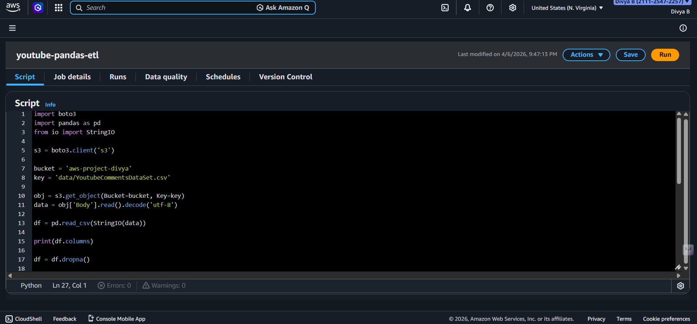

# YouTube Comments Sentiment Analysis - AWS Data Engineering Project

## Overview
This project demonstrates an end-to-end data engineering workflow using **AWS S3 + AWS Glue + Python Pandas** to analyze YouTube comments for sentiment.

### Key Features
- Read raw comments CSV from S3
- Perform data cleaning and sentiment classification (`positive`, `negative`, `neutral`)
- Save processed output back to S3
- Ready for Redshift or other analytics platforms

### Tools & Services
- AWS S3 (raw and processed storage)
- AWS Glue Python Shell Job
- Python (pandas, s3fs)
- Optional: Amazon Redshift (for future data warehouse integration)

### File Structure
- `glue-python-scripts/youtube-pandas-etl.py` → ETL script
- `data/sample_youtube_comments.csv` → sample dataset
- `notebooks/exploration.ipynb` → optional local analysis
- `requirements.txt` → Python dependencies

### Demo / Screenshots

#### Glue Job Run

#### Processed CSV in S3

